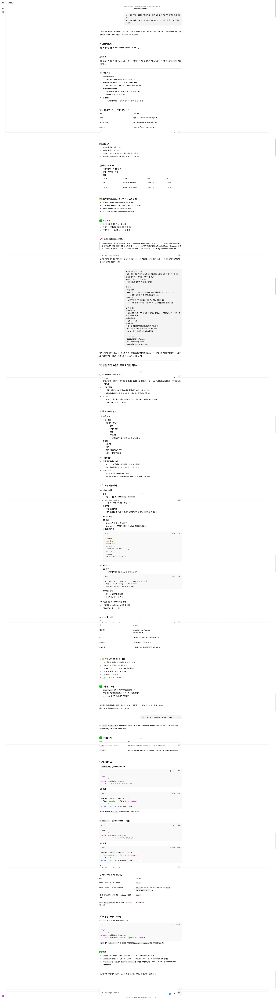

# Log

처음에는 ChatGPT를 사용하여 기획안을 작성하였고, GEMINI.md에 옮겨서 프로토 타입 개발을 진행.

처음에 작선한 코드는 Main에서 print만 출력하는 단순코드 였는데 심지어 돌아가지도 않음.
그래서 이거저거 고치라고 말해주니 Gemini가 코드를 수정해주었지만 당연히 안 돌아감.
그래서 뼈대는 내가 어느정도 만들고 Gemini가 코드를 작성해주는 식으로 진행함.

이후 중간 중간 개발 내용 바탕으로 GEMINI.md를 업데이트 하고 시키면서 개발 진행.
